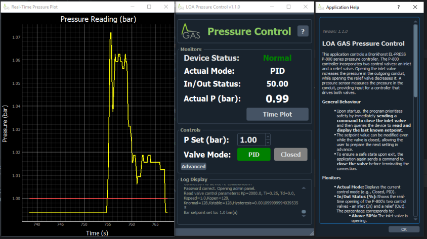

# Bronkhorst EL-PRESS P-800 Controller GUI

A graphical user interface (GUI) for controlling a Bronkhorst EL-PRESS P-800 series pressure controller, built using Python and PyQt5.

---

This application uses the official `bronkhorst-propar` library to communicate with the device.
* **Bronkhorst Website:** [www.bronkhorst.com](https://www.bronkhorst.com)
* **Propar Library:** [github.com/bronkhorst-developer/bronkhorst-propar](https://github.com/bronkhorst-developer/bronkhorst-propar)
  
---

## Hardware & Functionality

This application is specifically designed to control a **Bronkhorst EL-PRESS P-800 series** pressure controller.

The P-800 controller incorporates two control valves: an **inlet valve** and a **relief valve**. Opening the inlet valve increases the pressure in the outgoing conduit, while opening the relief valve decreases it. A pressure sensor continuously measures the pressure in the conduit, providing input for a controller that drives both valves to maintain a setpoint. This application provides the software interface to monitor and manage this process.

---

## Dependencies

This project is built with **Python 3.x** and requires the following packages:

* **PyQt5**: For the graphical user interface.
* **bronkhorst-propar**: For communication with the controller.
    ```bash
    pip install bronkhorst-propar
    ```
* **pyserial**: For automatic COM port detection.
    ```bash
    pip install pyserial
    ```
* **QDarkStyle**: A dark theme for PyQt applications.
    ```bash
    pip install qdarkstyle
    ```
* **pyqtgraph**: For real-time data plotting.
    ```bash
    pip install pyqtgraph
    ```

---

## Usage

To start the application, run the main Python script from your terminal:

```bash
python flowControl.py
  
 
